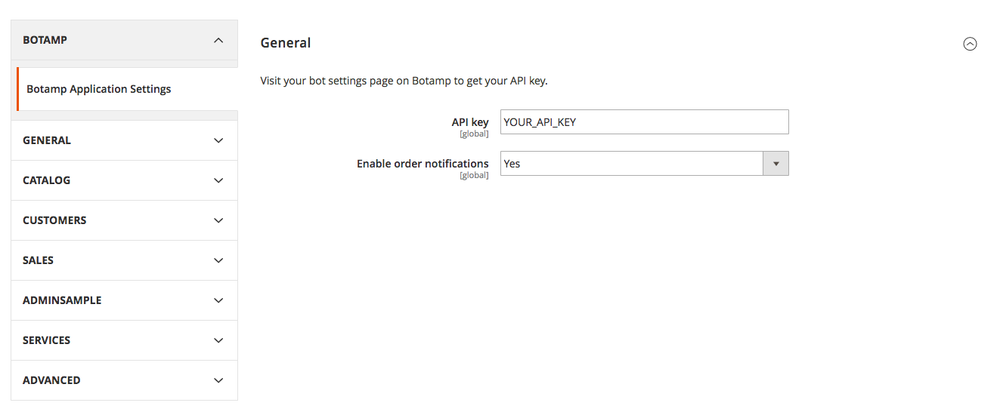
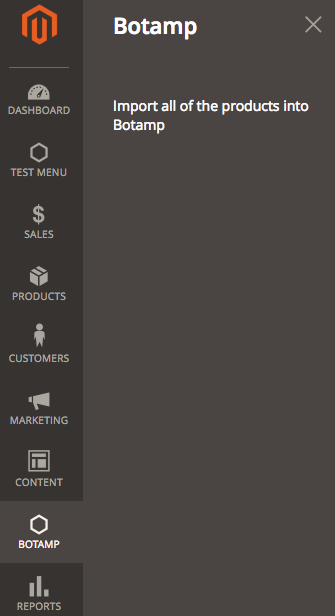

# Botamp Extension for Magento 2

Botamp is an autonomous AI-enabled chat assistant which interacts seamlessly with your customers, keeps them engaged and makes them buy more from you, while you can focus on serving them.

You can sign up for a Botamp account at https://botamp.com.

## Requirements

PHP 5.5, 5.6 or 7.0 (other PHP versions may work but untested), HHVM

## Settings
1. Enter your Botamp API key
2. Enable/Disable order notifications

## Features

### Create content
You create content for your bot just by creating a product. You can also import all of the products you previously created into your bot.

### Update content
The content you created for you bot is automatically updated whenever the corresponding post is updated.

### Delete content
The content you created for your bot is automatically deleted whenever the corresponding post is deleted.

### Order notifications
Your customers can subscribe to their order notifications by clicking on a button on the checkout page. Thus, they will receive notifications when their order status change. They can unsubscribe from their order notifications as well.
